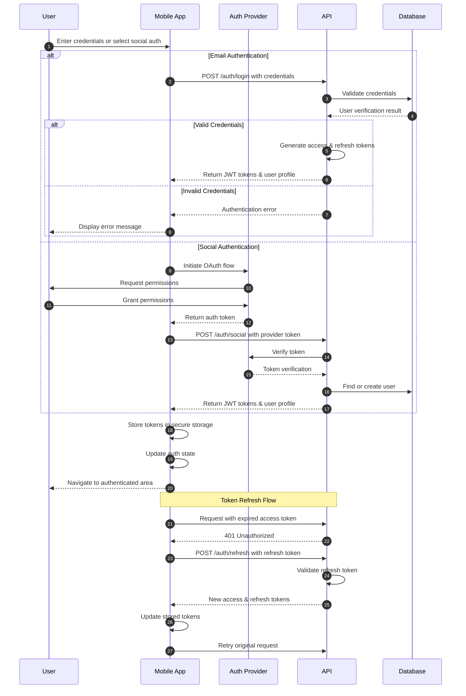
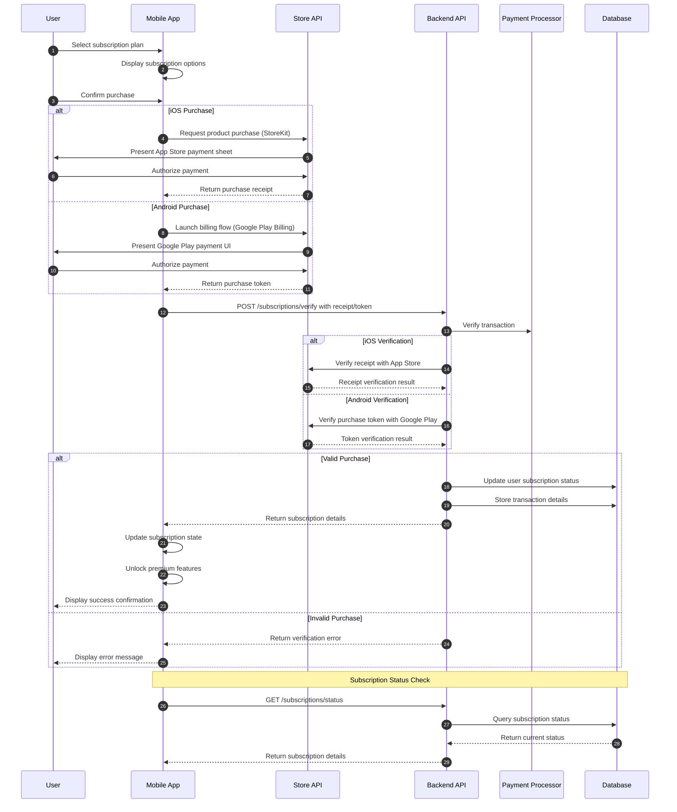
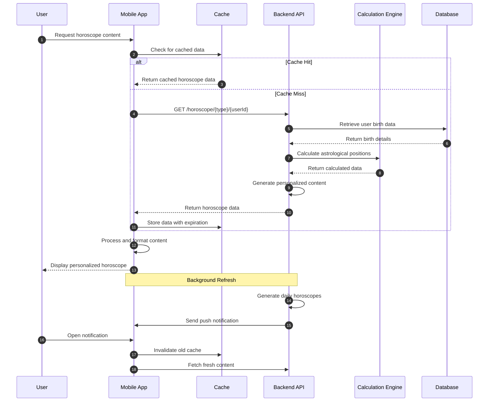
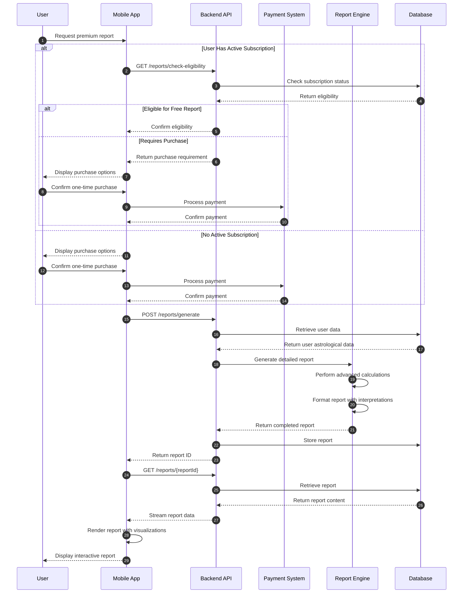
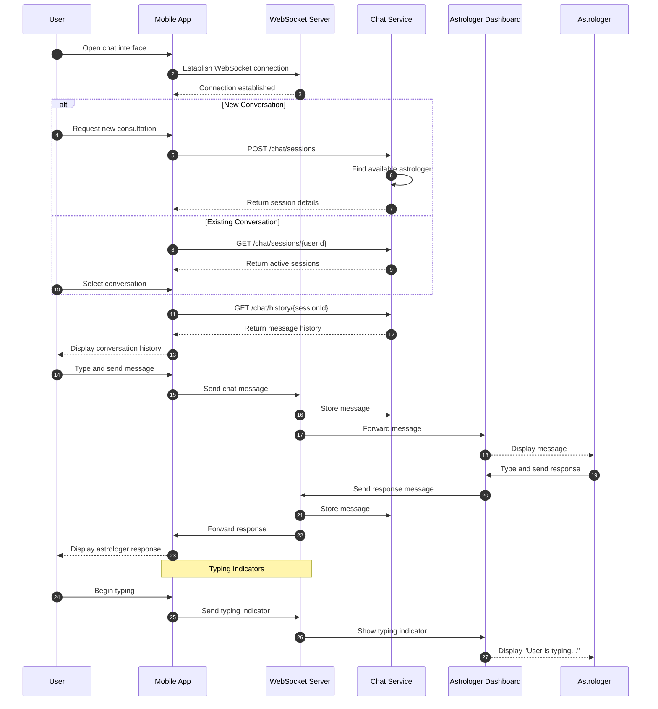
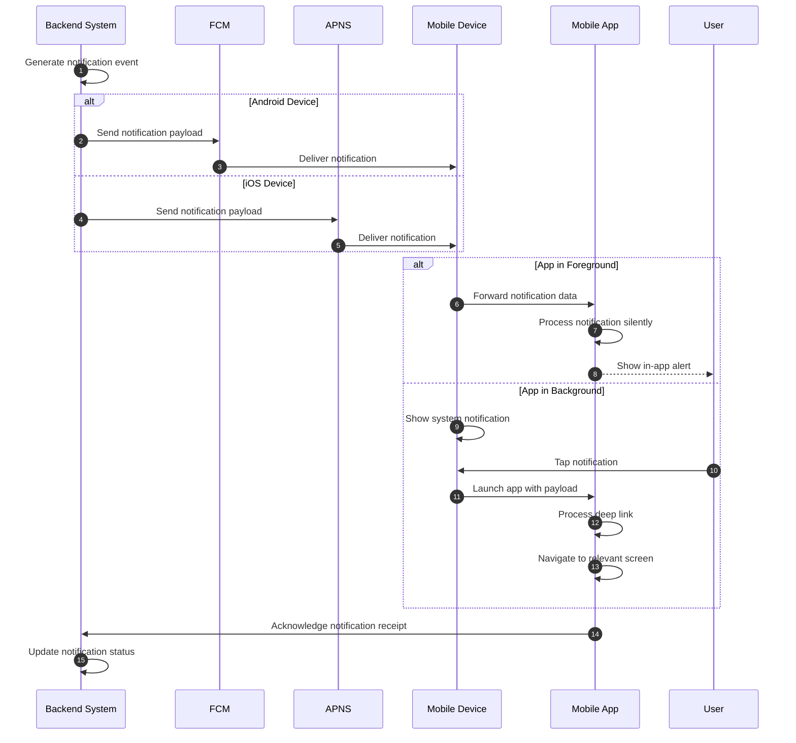
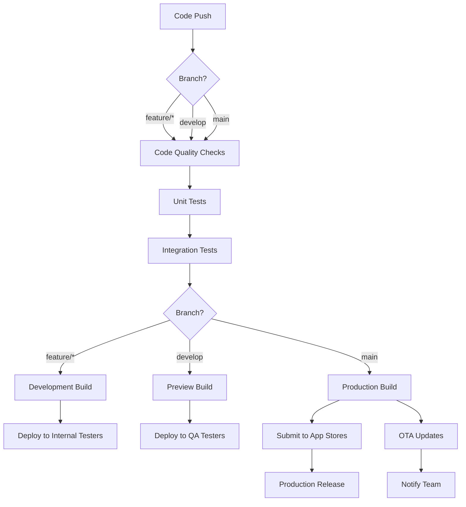

# Corp Astro Mobile Application


## 📱 Overview

Corp Astro is a comprehensive astrology mobile application that provides personalized horoscope readings, detailed astrological reports, and subscription-based premium features. The application is built with React Native and Expo, offering a seamless experience across both iOS and Android platforms.

This mobile application serves as the client-side interface that users interact with directly. It communicates with the Corp Astro backend API to retrieve astrological data, process payments, manage user accounts, and deliver personalized content. The application handles complex UI rendering, state management, offline capabilities, and device-specific features while the backend manages data persistence, business logic, and third-party integrations.

### Key Technologies

- **Framework**: React Native with Expo managed workflow
- **State Management**: Zustand for client-side state
- **Server State**: React Query (@tanstack/react-query) for data fetching and caching
- **UI Framework**: Tamagui for cross-platform UI components
- **Authentication**: Supabase Auth with secure token storage
- **Payments**: React Native IAP for in-app purchases
- **Notifications**: Firebase Cloud Messaging (FCM) for push notifications
- **Builds & Deployment**: Expo Application Services (EAS) for builds and OTA updates

## 🌟 Features

### User Experience

#### Personalized Astrological Content
- **Daily Horoscopes**: Personalized daily readings based on user's birth chart and current planetary positions
- **Weekly Forecasts**: Extended predictions covering career, relationships, and personal growth
- **Monthly Outlook**: Comprehensive monthly astrological forecasts with key date highlights
- **Yearly Overview**: Annual astrological roadmap with significant transits and opportunities
- **Zodiac Compatibility**: Detailed relationship compatibility analysis between different signs

#### Interactive Astrological Tools
- **Birth Chart Visualization**: Interactive natal chart with detailed planet positions and aspects
- **Transit Calendar**: Calendar view of upcoming significant planetary movements
- **Aspect Calculator**: Tool for calculating precise astrological aspects between planets
- **Moon Phase Tracker**: Real-time lunar phase monitoring with personalized impact analysis
- **Planetary Hours**: Daily breakdown of planetary hours with customized recommendations

#### Premium Content
- **In-depth Reports**: Comprehensive astrological analyses (25+ pages) with professional interpretations
- **Career Path Analysis**: Specialized reports on professional strengths and optimal career timing
- **Relationship Compatibility**: Detailed synastry reports between two birth charts
- **Life Purpose Reading**: Personalized guidance on life direction and spiritual purpose
- **Financial Forecasting**: Astrological timing for financial decisions and investments

#### Communication & Community
- **Astrologer Chat**: Real-time messaging with certified professional astrologers
- **Community Forums**: Topic-based discussion boards for astrological topics
- **Event Notifications**: Alerts for astronomical events (eclipses, retrogrades, etc.)
- **Content Sharing**: Ability to share readings and charts on social media platforms
- **Appointment Booking**: Scheduling system for live consultations with astrologers

### Technical Architecture

#### State Management & Data Flow
- **Zustand Store Architecture**: Lightweight state management with hooks-based API
  - `userStore.ts`: Manages user authentication state, profile data, and preferences
  - `themeStore.ts`: Handles theme preferences with system theme integration
  - `subscriptionStore.ts`: Tracks subscription status and purchase history
- **React Query Integration**: Server state management with automatic caching and revalidation
  - Optimistic updates for improved UX during network operations
  - Background refetching with configurable stale times
  - Automatic retry logic for failed requests
- **Persistence Layer**: Local storage with encryption for sensitive data
  - AsyncStorage for general app preferences
  - SecureStore for authentication tokens and payment information
  - Zustand persist middleware for seamless state rehydration

#### Authentication & Security
- **Multi-provider Authentication**: Sign-in with email, Apple, Google, and Facebook
- **Biometric Authentication**: Fingerprint and Face ID login options
- **JWT Token Management**: Secure token-based authentication with automatic refresh
- **Secure Storage**: Encrypted local storage for sensitive user data
- **Privacy Controls**: Granular user permissions for data sharing and notifications

#### Subscription & Payment Systems
- **Tiered Subscription Plans**: Multiple subscription levels with different feature sets
- **In-App Purchases**
  - **Implementation**: Uses `react-native-iap` library for cross-platform purchase handling
  - **Purchase Flow**:
    1. Products fetched from App Store/Google Play via `getProducts` and `getSubscriptions` APIs
    2. User initiates purchase through app UI
    3. Purchase validated locally and receipt sent to backend API
    4. Backend verifies receipt with platform stores
    5. Subscription status updated in database and synced to app
  - **Subscription Types**:
    - `MONTHLY`: Monthly recurring subscription (`com.corpastro.app.monthly`)
    - `YEARLY`: Annual subscription with discount (`com.corpastro.app.yearly`)
    - `LIFETIME`: One-time purchase for perpetual access (`com.corpastro.app.lifetime`)
  - **Analytics Integration**: Purchase events tracked with custom analytics hooks
  - **Error Handling**: Comprehensive error handling for network issues, store connectivity, and receipt validation failures
  - **Receipt Validation**: Server-side verification of purchase receipts with Apple/Google APIs
  - **Restore Purchases**: Functionality to restore previous purchases across devices
  - **Subscription Status**: Real-time tracking of subscription state with automatic refresh
  - **Trial Period**: Support for free trial periods with configurable durations
  - **Promotional Offers**: Support for introductory offers and limited-time promotions
  - **Restore Purchases**: Functionality to restore previous purchases across devices

#### Performance & Reliability
- **Offline Mode**: Core functionality and cached content available without internet
- **Background Sync**: Efficient data synchronization when connection is restored
- **Image Optimization**: Progressive loading and caching of astrological charts
- **Memory Management**: Optimized resource usage for extended app sessions
- **Error Recovery**: Graceful handling of API failures with automatic retry logic

#### Cross-platform Capabilities
- **Responsive Design**: Adaptive UI for different screen sizes and orientations
- **Platform-specific Features**: Native integration with iOS and Android capabilities
- **Accessibility Support**: VoiceOver, TalkBack, and dynamic text sizing compatibility
- **Dark Mode**: Full support for system-level dark mode preferences
- **Internationalization**: Complete localization infrastructure for multiple languages

## 🏗️ Architecture Overview

```
┌─────────────────┐      ┌─────────────────┐      ┌─────────────────┐
│                 │      │                 │      │                 │
│  Mobile Client  │◄────►│   Backend API   │◄────►│    Databases    │
│  (React Native) │      │   (Node.js)     │      │   (Supabase)    │
│                 │      │                 │      │                 │
└─────────────────┘      └─────────────────┘      └─────────────────┘
        │                        │                        │
        ▼                        ▼                        ▼
┌─────────────────┐      ┌─────────────────┐      ┌─────────────────┐
│                 │      │                 │      │                 │
│  App Stores     │      │  Push Services  │      │  Storage        │
│  (IAP Services) │      │  (Firebase)     │      │  (Supabase)     │
│                 │      │                 │      │                 │
└─────────────────┘      └─────────────────┘      └─────────────────┘
```

## 📂 Project Structure

The Corp Astro mobile application follows a modular architecture designed for scalability, maintainability, and clear separation of concerns. Below is a detailed breakdown of the project structure with explanations of each directory's purpose and contents.

```
corp-astro-mobile/
├── app/                      # Core application code
│   ├── screens/              # Screen components organized by feature
│   │   ├── auth/              # Authentication screens (login, register, password reset)
│   │   ├── horoscope/          # Daily, weekly, monthly horoscope screens
│   │   ├── profile/            # User profile and settings screens
│   │   ├── reports/            # Astrological report screens
│   │   ├── subscription/        # Subscription management screens
│   │   └── chat/               # Astrologer chat interface screens
│   ├── components/           # Screen-specific UI components
│   │   ├── charts/             # Astrological chart rendering components
│   │   ├── forms/              # Form components with validation
│   │   ├── modals/             # Modal dialog components
│   │   └── cards/              # Content card components
│   └── navigation/           # Navigation configuration
│       ├── stacks/             # Stack navigator configurations
│       ├── tabs/               # Tab navigator configurations
│       └── linking.ts          # Deep linking configuration
├── assets/                   # Static assets
│   ├── images/               # Image assets (PNG, JPG, SVG)
│   ├── fonts/                # Custom typography fonts
│   ├── animations/            # Lottie animation files
│   └── sounds/                # Audio files for notifications
├── components/               # Shared reusable components
│   ├── buttons/               # Button component variants
│   ├── typography/            # Text component variants
│   ├── layout/                # Layout components (containers, grids)
│   ├── inputs/                # Input field components
│   └── feedback/              # Loading, error, and success components
├── hooks/                    # Custom React hooks
│   ├── useAuth.ts             # Authentication state hook
│   ├── useIAP.ts              # In-app purchase hook
│   ├── useAnalytics.ts        # Analytics tracking hook
│   ├── useHoroscope.ts        # Horoscope data fetching hook
│   ├── useNotifications.ts    # Push notification hook
│   ├── useForm.ts             # Form state management hook
│   ├── useOffline.ts          # Offline state detection hook
│   └── useAstrology.ts        # Astrological calculations hook
├── services/                 # API and third-party integrations
│   ├── api/                  # Backend API client
│   │   ├── client.ts          # Axios/fetch configuration with interceptors
│   │   ├── auth.ts            # Authentication API endpoints
│   │   ├── horoscope.ts        # Horoscope API endpoints
│   │   ├── reports.ts          # Reports API endpoints
│   │   ├── subscriptions.ts    # Subscription API endpoints
│   │   └── chat.ts            # Chat API endpoints
│   ├── iap/                  # In-App Purchase handling
│   │   ├── IAPManager.ts       # Core IAP functionality
│   │   ├── IAPProducts.ts      # Product definitions
│   │   ├── IAPReceipts.ts      # Receipt validation
│   │   └── IAPSubscriptions.ts # Subscription status tracking
│   ├── analytics/            # Analytics tracking
│   │   ├── AnalyticsService.ts # Core analytics functionality
│   │   ├── events.ts          # Event definitions
│   │   └── trackers.ts        # Event tracking implementations
│   ├── notifications/        # Push notification services
│   │   ├── NotificationService.ts # Notification handling
│   │   ├── NotificationPermissions.ts # Permission handling
│   │   └── NotificationPayloads.ts # Payload processing
│   ├── storage/              # Local storage services
│   │   ├── SecureStorage.ts    # Encrypted storage for sensitive data
│   │   ├── AsyncStorage.ts     # General persistent storage
│   │   └── CacheStorage.ts     # Temporary cache management
│   └── websocket/            # WebSocket connection for chat
├── state/                    # State management
│   ├── auth/                 # Authentication state
│   │   ├── authSlice.ts        # Auth state reducer
│   │   ├── authActions.ts      # Auth action creators
│   │   └── authSelectors.ts    # Auth state selectors
│   ├── subscriptions/        # Subscription state
│   │   ├── subscriptionSlice.ts # Subscription reducer
│   │   ├── subscriptionActions.ts # Subscription actions
│   │   └── subscriptionSelectors.ts # Subscription selectors
│   ├── horoscope/            # Horoscope data state
│   ├── reports/              # Reports data state
│   ├── user/                 # User profile state
│   ├── chat/                 # Chat message state
│   └── store.ts              # Redux store configuration
├── utils/                    # Utility functions
│   ├── date.ts                # Date formatting and manipulation
│   ├── validation.ts           # Input validation functions
│   ├── formatting.ts           # Text and number formatting
│   ├── astrology.ts            # Astrological calculation utilities
│   └── testing.ts              # Test helper utilities
├── i18n/                     # Internationalization
│   ├── translations/          # Language translation files
│   ├── config.ts               # i18n configuration
│   └── formatters.ts           # Locale-specific formatters
├── firebase/                 # Firebase configuration (FCM)
│   ├── config.ts               # Firebase app configuration
│   └── messaging.ts            # FCM specific configuration
├── ios/                      # iOS-specific native code
│   ├── Pods/                  # CocoaPods dependencies
│   ├── CorpAstro/             # iOS app code
│   │   ├── AppDelegate.m       # iOS app delegate
│   │   ├── Info.plist          # iOS app configuration
│   │   └── Images.xcassets     # iOS app icons and images
│   └── CorpAstro.xcodeproj    # Xcode project file
├── android/                  # Android-specific native code
│   ├── app/                  # Android app code
│   │   ├── src/                # Java/Kotlin source files
│   │   ├── res/                # Android resources
│   │   └── AndroidManifest.xml # Android app configuration
│   └── build.gradle          # Android build configuration
├── tests/                    # Test files
│   ├── unit/                 # Unit tests
│   └── e2e/                  # End-to-end tests
├── scripts/                  # Build and utility scripts
│   ├── iap-verification.js    # IAP verification script
│   ├── generate-icons.js      # App icon generation script
│   └── localization-sync.js   # Translation sync script
├── app.json                  # React Native app configuration
├── app.config.js             # Expo configuration
├── babel.config.js           # Babel transpiler configuration
├── tsconfig.json             # TypeScript configuration
├── package.json              # NPM dependencies and scripts
├── eas.json                  # Expo Application Services config
└── tamagui.config.ts         # UI component library config
```

### Key Directory Explanations

#### `/app`
Contains the core application code organized by features. Each feature typically includes screens, components specific to those screens, and related navigation configuration.

#### `/services`
Houses all external service integrations, API clients, and third-party SDK implementations. This directory follows a modular approach where each service is self-contained with its own configuration, models, and API methods.

#### `/state`
Implements the application's state management using Redux with a slice pattern. Each slice corresponds to a distinct domain of the application (auth, subscriptions, etc.) and contains its reducers, actions, and selectors.

#### `/hooks`
Contains custom React hooks that encapsulate reusable stateful logic. These hooks abstract complex operations and side effects, making components cleaner and more focused on rendering.

#### `/components`
Houses shared UI components used across multiple screens. These components are designed to be highly reusable, configurable, and follow consistent styling patterns defined in the theme directory.

#### `/firebase`
Contains Firebase configuration for Firebase Cloud Messaging (FCM), which handles push notifications across both iOS and Android platforms.


## 🔄 Data Flow

This section details the key data flows within the Corp Astro mobile application, illustrating how information moves between the user interface, application logic, external services, and the backend API.

### Authentication Flow

The authentication process securely identifies users and grants appropriate access permissions while maintaining security best practices.



### Subscription Purchase Flow

The subscription flow handles the entire process from purchase initiation through validation to granting premium access.



### Horoscope Data Retrieval Flow

This flow illustrates how personalized astrological content is fetched and displayed to users.



### Report Generation Flow

This diagram shows how premium astrological reports are generated, purchased, and delivered to users.



### Real-time Chat Flow

This diagram illustrates the WebSocket-based communication between users and professional astrologers.



### Push Notification Flow

This diagram shows how the application handles push notifications for various events.



## 🚀 Getting Started

### Prerequisites

#### Required Software
- **Node.js**: Version 16.x or higher (18.x recommended)
- **Package Manager**: Yarn 1.22.x or npm 8.x+
- **Expo CLI**: Version 6.x or higher (`npm install -g expo-cli`)
- **Git**: Latest version recommended for version control

#### Platform-specific Requirements

**For iOS Development:**
- **macOS**: Monterey (12.x) or newer
- **Xcode**: Version 14.x or higher with Command Line Tools installed
- **CocoaPods**: Version 1.11.x or higher (`gem install cocoapods`)
- **iOS Device or Simulator**: iOS 15.0+ for testing

**For Android Development:**
- **Android Studio**: Latest version with Android SDK Platform 33 (Android 13)
- **Java Development Kit (JDK)**: Version 11 or higher
- **Android Device or Emulator**: API level 29+ (Android 10.0+) for testing
- **Android SDK Build-Tools**: Version 33.0.0 or higher

### Installation

1. **Clone the repository**
   ```bash
   git clone https://github.com/your-org/corp-astro-mobile.git
   cd corp-astro-mobile
   ```

2. **Install dependencies**
   ```bash
   # Using Yarn (recommended)
   yarn install
   
   # Using npm
   npm install
   ```

3. **Set up environment variables**
   ```bash
   cp .env.example .env
   ```
   
   Edit `.env` with your configuration values. The following variables are required:
   
   ```
   # API Configuration
   API_URL=https://api.corp-astro.com
   API_TIMEOUT=30000
   
   # Authentication
   AUTH_PERSISTENCE_KEY=@CorpAstro:auth
   
   # Feature Flags
   ENABLE_ANALYTICS=true
   ENABLE_CRASH_REPORTING=true
   
   # Services
   FIREBASE_API_KEY=your_firebase_api_key
   FIREBASE_APP_ID=your_firebase_app_id
   FIREBASE_MESSAGING_SENDER_ID=your_firebase_sender_id
   FIREBASE_PROJECT_ID=your_firebase_project_id
   
   # App Configuration
   APP_ENV=development
   ```

4. **Install iOS pods** (if developing for iOS)
   ```bash
   cd ios && pod install && cd ..
   ```

5. **Start the development server**
   ```bash
   # Using Expo
   yarn start
   # or
   expo start
   
   # With clearing cache
   yarn start --clear
   ```

6. **Run on iOS or Android**
   ```bash
   # For iOS Simulator
   yarn ios
   # or specific device
   yarn ios --device "iPhone 14 Pro"
   
   # For Android Emulator
   yarn android
   # or specific device by ID
   yarn android --deviceId YOUR_DEVICE_ID
   ```

### Development Builds

For testing features that require native capabilities not available in Expo Go:

1. **Create a development build**
   ```bash
   # For iOS
   eas build --profile development --platform ios
   
   # For Android
   eas build --profile development --platform android
   ```

2. **Install the development build**
   - For iOS: Install via TestFlight or direct IPA installation
   - For Android: Install the APK on your device

3. **Start development server with development client**
   ```bash
   yarn start --dev-client
   ```

### Troubleshooting Common Setup Issues

#### Metro Bundler Issues
- **Error**: "Unable to resolve module..."
  - Solution: Clear Metro cache with `yarn start --clear`

#### iOS Build Failures
- **Error**: CocoaPods dependencies issues
  - Solution: `cd ios && pod deintegrate && pod install && cd ..`

#### Android Build Failures
- **Error**: Gradle version conflicts
  - Solution: Check `android/build.gradle` for correct configurations

#### Environment Variables Not Loading
- **Error**: "Cannot read property 'API_URL' of undefined"
  - Solution: Ensure `.env` file is properly formatted and restart the development server
3. Or run `yarn android` if you have an emulator

## 🧪 Testing

The Corp Astro mobile application employs a comprehensive testing strategy to ensure reliability, performance, and correctness across all features.

### Testing Architecture

The testing architecture follows a pyramid approach with unit tests forming the foundation, integration tests in the middle, and end-to-end tests at the top.

#### Unit Testing

Unit tests focus on individual components, hooks, and utility functions in isolation.

```bash
# Run all unit tests
yarn test

# Run tests with coverage report
yarn test:coverage

# Run tests in watch mode during development
yarn test:watch

# Run tests for a specific file or pattern
yarn test -- -t "AuthContext"
```

**Key Testing Libraries:**
- **Jest**: Test runner and assertion library
- **React Testing Library**: Component testing utilities
- **Mock Service Worker**: API mocking

**Unit Test Structure:**
```typescript
describe('Component: Button', () => {
  it('renders correctly with default props', () => {
    // Test implementation
  });
  
  it('calls onPress handler when pressed', () => {
    // Test implementation
  });
  
  it('applies correct styling based on variant prop', () => {
    // Test implementation
  });
});
```

#### Integration Testing

Integration tests verify that different parts of the application work together correctly.

```bash
# Run integration tests
yarn test:integration
```

**Integration Test Focus Areas:**
- API service interactions
- State management flows
- Navigation between screens
- Form submissions and validations

#### End-to-End Testing

E2E tests simulate real user interactions across the entire application.

```bash
# Run E2E tests
yarn e2e

# Run E2E tests on specific platform
yarn e2e:ios
yarn e2e:android

# Run specific E2E test scenario
yarn e2e -- --testNamePattern="User subscription flow"
```

**E2E Testing Tools:**
- **Detox**: End-to-end testing framework for React Native
- **Appium**: Mobile automation testing for complex scenarios
- **Maestro**: Flow testing for critical user journeys

### Test Data Management

The application uses fixture data for consistent test scenarios:

```bash
# Location of test fixtures
src/tests/fixtures/
```

Test data is organized by domain and includes:

- **User profiles**: Various user types with different subscription levels
- **Horoscope data**: Daily, weekly, and monthly horoscope content
- **Birth charts**: Sample birth chart data for different zodiac signs
- **Payment records**: Mock purchase receipts and subscription statuses
- **API responses**: Standardized API response templates

### Visual Regression Testing

Visual regression tests capture screenshots of UI components and compare them against baselines to detect unintended visual changes.

```bash
# Run visual regression tests
yarn test:visual

# Update visual snapshots
yarn test:visual:update
```

**Visual Testing Strategy:**

1. **Component snapshots**: Individual UI components across different states
2. **Screen snapshots**: Complete screens with various data conditions
3. **Theme testing**: UI components across light/dark modes and different zodiac themes
4. **Responsive testing**: Components at different screen sizes and orientations

### Performance Testing

Performance tests measure rendering times, memory usage, and application responsiveness.

```bash
# Run performance tests
yarn test:performance
```

**Key Performance Metrics:**
- **Time to Interactive (TTI)**: How quickly screens become interactive
- **JavaScript heap size**: Memory consumption during various operations
- **Frame rate**: Maintaining 60fps during animations and transitions
- **API response handling**: Time to process and render API data
- **Cold start time**: Application launch performance
- **Bundle size**: Monitoring and optimizing bundle size

### IAP Analytics Verification

Specialized testing for in-app purchase flows and analytics tracking:

```bash
cd scripts
node run_iap_analytics_verification.js
```

This script validates:
- Purchase event tracking
- Revenue attribution
- Subscription conversion funnels
- Receipt validation flows

### Continuous Integration Testing

All tests are automatically run in the CI pipeline on GitHub Actions for every pull request and merge to main branches.

```yaml
# Test workflow in CI
name: Test
on: [push, pull_request]
jobs:
  test:
    runs-on: ubuntu-latest
    steps:
      - uses: actions/checkout@v3
      - uses: actions/setup-node@v3
        with:
          node-version: '18'
      - run: yarn install
      - run: yarn test
```

### Testing Best Practices

1. **Write tests before code** (Test-Driven Development) when appropriate
2. **Mock external dependencies** to isolate the code being tested
3. **Test edge cases** including error handling and boundary conditions
4. **Keep tests independent** from each other to prevent cascading failures
5. **Use data-testid attributes** for component selection rather than implementation details
6. **Maintain test coverage** above 80% for critical application paths
7. **Automate regression testing** to catch regressions early
8. **Test across multiple devices** to ensure consistent behavior
9. **Include accessibility testing** to support all users
10. **Regular performance benchmarking** to prevent performance degradation

## 🔧 Configuration Files

The Corp Astro mobile application uses a variety of configuration files to manage dependencies, build processes, and environment-specific settings.

### Core Configuration Files

| File | Purpose | Description |
| ---- | ------- | ----------- |
| `.env` | Environment variables | Contains API endpoints, feature flags, and service credentials. Different versions exist for development, staging, and production environments. |
| `.env.development` | Development environment | Configuration specific to local development environment. |
| `.env.staging` | Staging environment | Configuration for the staging/QA environment. |
| `.env.production` | Production environment | Configuration for the production environment. |
| `app.json` | Expo configuration | Defines the application name, slug, version, orientation, icon, splash screen, and other Expo-specific settings. |
| `app.config.js` | Dynamic Expo config | JavaScript-based configuration that can dynamically generate values based on environment variables. |
| `babel.config.js` | Babel transpiler settings | Configures JavaScript/TypeScript transpilation, including plugins for module resolution and code transformations. |
| `tsconfig.json` | TypeScript configuration | TypeScript compiler options, path aliases, and type checking rules. |
| `package.json` | Dependencies and scripts | Lists all npm dependencies, development dependencies, and defines scripts for various operations. |
| `eas.json` | EAS Build configuration | Configuration for Expo Application Services builds, including build profiles for development, preview, and production. |

### Platform-Specific Configuration

| File | Purpose | Description |
| ---- | ------- | ----------- |
| `ios/Podfile` | iOS dependencies | CocoaPods configuration for iOS native dependencies. |
| `ios/[AppName]/Info.plist` | iOS app settings | iOS-specific configuration including permissions, capabilities, and app settings. |
| `android/app/build.gradle` | Android build config | Android-specific build configuration including dependencies and build types. |
| `android/app/src/main/AndroidManifest.xml` | Android manifest | Defines Android permissions, activities, and other Android-specific settings. |

### Development Tools Configuration

| File | Purpose | Description |
| ---- | ------- | ----------- |
| `.eslintrc.js` | ESLint configuration | JavaScript/TypeScript linting rules to enforce code quality and consistency. |
| `.prettierrc` | Prettier configuration | Code formatting rules for consistent code style across the project. |
| `jest.config.js` | Jest test configuration | Configuration for the Jest testing framework, including test environment and coverage settings. |
| `detox.config.js` | Detox E2E test config | Configuration for Detox end-to-end testing, including device configurations and test runners. |
| `.github/workflows/*.yml` | CI/CD workflows | GitHub Actions workflows for continuous integration and deployment processes. |

### Configuration Management Best Practices

1. **Environment Variable Handling**
   - Never commit sensitive values to version control
   - Use placeholder values in `.env.example`
   - Document all required environment variables

2. **Configuration Validation**
   - Validate required configuration at app startup
   - Provide meaningful error messages for missing configuration
   - Use TypeScript interfaces to enforce configuration structure

3. **Feature Flags**
   - Use environment variables for feature flags
   - Implement a centralized feature flag service
   - Support remote configuration updates when possible

### Example Configuration Usage

```typescript
// src/config/index.ts
import Constants from 'expo-constants';

interface AppConfig {
  apiUrl: string;
  apiTimeout: number;
  enableAnalytics: boolean;
  version: string;
}

const config: AppConfig = {
  apiUrl: Constants.expoConfig?.extra?.apiUrl || 'https://api.default.com',
  apiTimeout: Number(Constants.expoConfig?.extra?.apiTimeout || 30000),
  enableAnalytics: Constants.expoConfig?.extra?.enableAnalytics === 'true',
  version: Constants.expoConfig?.version || '1.0.0',
};

export default config;
```

## 📱 Key Features Implementation

### In-App Purchases
The app uses `react-native-iap` to handle subscriptions and one-time purchases. The implementation follows Apple and Google's latest guidelines for StoreKit 2 and Google Play Billing Library 5.

**Key files:**
- `services/iap/IAPManager.ts` - Core IAP functionality
- `services/iap/IAPProducts.ts` - Product definitions
- `hooks/useIAP.ts` - React hook for IAP operations

### Firebase Cloud Messaging (FCM)
Push notifications are implemented using Firebase Cloud Messaging with native modules integration.

**Key files:**
- `firebase/config.ts` - Firebase configuration
- `services/notifications/NotificationService.ts` - Notification handling
- `android/app/src/main/java/.../FCMService.java` - Android FCM service

### Analytics Tracking
The app implements comprehensive analytics tracking for user actions, conversion events, and error monitoring.

**Key files:**
- `services/analytics/AnalyticsService.ts` - Core analytics functionality
- `hooks/useAnalytics.ts` - React hook for tracking events
- `services/analytics/events.ts` - Event definitions

## 🔄 CI/CD and Deployment

The app uses GitHub Actions for continuous integration and deployment, with Expo Application Services (EAS) handling the build process.

### Build Profiles

We use different EAS build profiles for various stages of development:

| Profile | Purpose | Configuration |
|---------|---------|---------------|
| `development` | Local testing | Development client with dev server connection |
| `preview` | QA testing | Production build with staging API endpoints |
| `production` | App store submission | Optimized production build with production endpoints |

### Build Commands

**iOS Builds:**
```bash
# Development build
eas build --profile development --platform ios

# Preview build
eas build --profile preview --platform ios

# Production build
eas build --profile production --platform ios
```

**Android Builds:**
```bash
# Development build
eas build --profile development --platform android

# Preview build
eas build --profile preview --platform android

# Production build
eas build --profile production --platform android
```

### App Store Submission

After building for production, submit to the respective app stores:

**iOS App Store:**
```bash
eas submit --platform ios --latest
```

**Google Play Store:**
```bash
eas submit --platform android --latest
```

### Over-The-Air (OTA) Updates

We use Expo's OTA update system to deploy JavaScript bundle updates without requiring a new app store submission:

```bash
# Publish update to all users on production channel
eas update --branch production

# Publish update to beta testers
eas update --branch preview

# Publish update to internal testers
eas update --branch development
```

### CI/CD Pipeline Workflow



### CI/CD Workflow Stages

1. **Code Quality Checks**
   - ESLint for code style enforcement
   - TypeScript type checking
   - Dependency security scanning

2. **Build Process**
   - EAS Build for native app compilation
   - Environment-specific configuration injection
   - Code signing with secure credentials

3. **Deployment**
   - Automated submission to app stores (for production builds)
   - Distribution to internal testers (for development/preview builds)
   - OTA updates for quick fixes and minor updates

4. **Notifications**
   - Slack notifications on build completion
   - Email alerts for failed workflows
   - Release notes generation

### Environment-Specific Configurations

| Branch | Build Profile | Destination | API Endpoints |
|--------|---------------|-------------|---------------|
| `feature/*` | development | Internal testers | Development |
| `develop` | preview | QA testers | Staging |
| `main` | production | App stores | Production |

### Security Considerations

- **Secret Management**: All API keys, certificates, and credentials are stored in GitHub Secrets
- **Environment Variables**: Sensitive values are scoped at the step level in workflows
- **Code Signing**: Secure handling of iOS certificates and Android keystores
- **Access Control**: Limited access to production deployment capabilities

See `.github/workflows/ci-cd.yml` for the complete workflow configuration.

## 🔗 Integration with Backend

The mobile app communicates with the [Corp Astro API](https://github.com/Project-Corp-Astro/Dif_API) through:

1. **REST API Calls**: For data fetching and user operations
2. **WebSockets**: For real-time chat and notifications
3. **Webhook Handling**: For subscription events from payment providers

## 📚 Additional Documentation

- [IAP Integration Guide](./IAP_INTEGRATION_GUIDE.md) - Detailed guide on IAP implementation
- [FCM Migration Guide](./FCM_MIGRATION_GUIDE.md) - Guide for FCM integration
- [Sandbox Testing Setup](./IOS_SANDBOX_TESTING_SETUP.md) - Instructions for testing IAPs
- [Deployment Plan](./IAP_DEPLOYMENT_PLAN.md) - Deployment instructions

## 🤝 Contributing

1. Fork the repository
2. Create your feature branch: `git checkout -b feature/amazing-feature`
3. Commit your changes: `git commit -m 'Add some amazing feature'`
4. Push to the branch: `git push origin feature/amazing-feature`
5. Open a Pull Request

## 📞 Support

For questions or support, please contact the development team at dev@corpastro.com

## 🔗 Related Repositories

- [Corp Astro API](https://github.com/Project-Corp-Astro/Dif_API) - Backend API services
